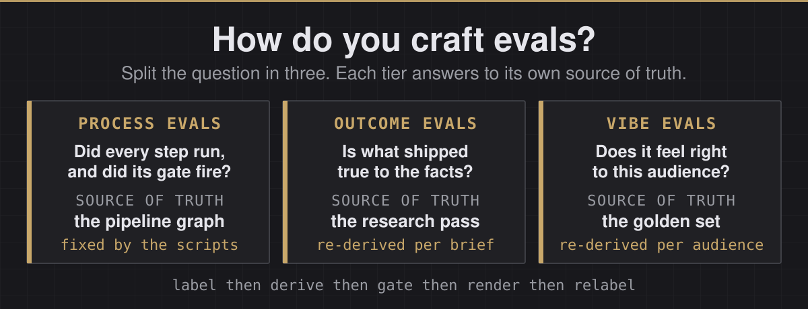

<p align="center">
  
</p>

<p align="center">
  
  
  
  
  
  
</p>

An agent wrote, voiced and rendered thirty-eight short video ads, for five invented brands and ten real products, on four AI video engines, with nobody watching. It was allowed to spend money only when checks built from hand-graded examples said the work was good enough. This page is how those checks were built.

**How do you craft evals? Split the question in three, and give each part its own source of truth.**

| | The question it answers | Where its truth comes from | When it changes |
|:---|:---|:---|:---|
| **Process evals** | Did every step run, in order, and did its gate fire before money moved? | The pipeline's own graph | Only when the scripts change |
| **Outcome evals** | Is what shipped true, to the brief and to the facts it leans on? | The research pass behind the brief | Every time the brief changes |
| **Vibe evals** | Does it feel right to the audience it was made for? | A golden set of hand-labelled exemplars, plus the market's own bar | Every time the audience changes |

Three words repeat on this page, and they are one idea. A **probe** is a check, a **threshold** is the line that check has to clear, and a **gate** is what stops the job when the line is not cleared. The hard part was never making the video. It is deciding, with nobody in the room, whether the video is good enough to pay for. The three tiers split that decision into pieces small enough to build.

The first tier is the skeleton and it stays put. The other two are the parts you swap. Point the same loop at a new product and the outcome evals are re-derived from fresh research. Point it at a new audience and the vibe evals are re-derived from a fresh golden set. The proof below comes from one ad production that ran end to end with nobody driving. Twenty-eight governed versions across five invented brands, then ten spec ads for real products, every render gated before a dollar moved.

<table>
  <tr>
    <td width="33%" align="center" valign="top"><a href="#1-process-evals"></a><br><b>Process.</b> Fifty-nine scene renders across four rounds sit in the ledger behind the eight cuts that shipped, and every gate fired before a dollar moved. <a href="#1-process-evals">See the ledger</a></td>
    <td width="33%" align="center" valign="top"><a href="#2-outcome-evals"></a><br><b>Outcome.</b> Four hundred pages fold into one. The line this spot closes on is the line on the company's own page, checked by a second engine told to refute it. <a href="#2-outcome-evals">See the spec ads</a></td>
    <td width="33%" align="center" valign="top"><a href="#3-vibe-evals"></a><br><b>Vibe.</b> Four engines shot the same coffee brief. A panel tuned to morning craving picked this one, and a panel tuned to sleep picked a different engine for a different brand. <a href="#3-vibe-evals">See the race</a></td>
  </tr>
</table>

> The presenter is generated. She is not a real person and not a likeness of one, and her voice is a clone of a consented source. Every version of every spot is scored on this page or in its ledger, and the failures sit next to the winners.

---

## 1. Process evals

Process evals check the trajectory, not the result. The industry name is process supervision. Every step has a contract, the contract is checked the moment the step runs, and a failed check stops the job before the next dollar is spent. The source of truth is the pipeline graph, an orchestration framework such as LangGraph in most stacks and plain scripts here, so this tier moves only when the scripts move. The exact scripts that ran are in this repository. The boards, batch drivers and ledgers are in [`shoots/`](shoots/). The board probe, caption gate and closer checks are in [`gates/`](gates/), the pixel probes in [`probes/`](probes/), the pre-spend guards in [`guards/`](guards/). The code map near the end says what each file is.

| Step | What it has to prove before the next step may start | How it fails |
|:---|:---|:---|
| Board | Five mechanical checks, free, before a cent is spent (the product absent before the payoff, the escalation declared, the quirk never spoken by the narration, mouths closed under narration, the centre-crop clause present), then four judgment rows the eye scores 0 to 3 | The board goes back |
| Render | Every request and every landing appended to the ledger, the vendor's own rejection text included | Recorded, re-rolled once with one variable moved |
| Closer | Identity pin on the voice and avatar ids, prop gate on the look, crop and body guards, jaw measured on the raw render and refused over the band | Pre-spend |
| Build | The closer's video starts within 40 ms of where its audio was placed | Frame-exact, on the master |
| Ad gates | Every burned cue says what is spoken, within 0.5 s before or 0.3 s after its first word. The closer's mouth is not late | Blocks delivery |
| Ship gate | Loudness, true peak, silence tail, the standing disclosures. Exit 64 on unreadable input | Fails closed |
| Deliver | A defective delivered cut is withdrawn, replaced, and the withdrawal ledgered with its reason | On the record |

### The redo, as a ledger reads it

Four invented-brand spots were shot again after the curator, the human on the loop who reviews every cut by eye, kept rejecting boards. The grammar that survived is the one he named. Open absurd at three or four times the volume, hand over the coherent model by the second line, and keep every quirk visual with nobody narrating it. Each spot shipped two ways, on the engine that won its panel in the four-engine race in section 3 and on an Omni Flash leg from the same boards, narrations, closers, beds and captions. The only variable between the columns is the engine. The [ledgers](shoots/) hold four rounds behind them, 16, 16, 12 and 15 scene requests, 59 in all, for eight shipped versions. Two of those rounds built four masters each and neither shipped.

<table>
  <tr>
    <td width="50%" align="center" valign="top"><br><b>Orchard Hill Coffee, Seedance 2.0.</b> <a href="https://github.com/jameswniu/ad-creative-pipeline-multimodal-evals/releases/download/media-2026-08/shoot-20260826-seedance2-orchard.mp4">&#9654; with sound</a></td>
    <td width="50%" align="center" valign="top"><br><b>Orchard Hill Coffee, Omni Flash.</b> <a href="https://github.com/jameswniu/ad-creative-pipeline-multimodal-evals/releases/download/media-2026-08/shoot-20260826-omni-orchard.mp4">&#9654; with sound</a></td>
  </tr>
</table>

| Process record, Orchard Hill Coffee | Seedance 2.0 | Omni Flash |
|:---|:---|:---|
| Scene renders in the ledger across the rounds, re-rolls included | 11 | 3 |
| Caption gate on the shipped master | PASS, 5 cues | PASS, 5 cues |
| Closer video against its audio placement | 0 ms | 0 ms |
| Mouth sync on the shared closer | PASS, +0.08 s | PASS, +0.08 s |
| Master that shipped | v3 | v1 |

| The other three spots | Renders in the ledger, winner's engine and Omni | Mouth sync on the shared closer | Masters that shipped |
|:---|:---|:---|:---|
| Lantern Street, Wan 3.0 | 8 and 3 | REVIEW, 0.00 s, eye approved | v7 and v1 |
| Harbor Lane Realty, Wan 3.0 | 12 and 5, the sign scene re-rolled for an invented phone number | PASS, 0.00 s | v5 and v2 |
| Slow Road Travel, Seedance 2.0 | 11 and 4 | REVIEW, +0.04 s, eye approved | v4 and v1 |

Every one of the eight masters passed the caption gate at five cues and held its closer at 0 ms drift. REVIEW means the mouth probe could not read the closer well enough to rule and handed the call to the eye, which is logged as such. All eight cuts are in the [media release](https://github.com/jameswniu/ad-creative-pipeline-multimodal-evals/releases/tag/media-2026-08), with sound.

- Prompt-level constraints, written in the strongest form available, held on 6 of 15 attempts. A pre-call hook made the outcome right on 14 of 15, measured in [docs/ENFORCEMENT.md](docs/ENFORCEMENT.md). Rank a constraint by what happens when it is violated, and give a mechanism to any constraint whose violation is silent.
- The face-located mouth probe went in with its sign inverted and doubled the error it was built to remove. The gate caught it on the master. Three days later the same sign confusion came back in a different builder and reached the review thread, where a frame-by-frame audit found it rather than a probe. That auto-alignment is off now, and the check that replaced it is a frame ladder read by eye.
- Four guards protect the render path and three approve everything when a file they depend on goes missing, two of them without knowing it. A guard that fails open is a log line.

---

## 2. Outcome evals

Outcome evals check the artifact against the facts and do not care how it got made. The industry name is outcome supervision, and in retrieval terms it is a groundedness check. The claim on screen is compared with the source it was pulled from, never with the model's confidence in it. In most stacks those facts arrive through retrieval, the RAG layer. Here they arrived through a pairwise research pass, one engine scanning the company's live pages and the other told to refute what it found. Either way the whole tier is re-derived when the brief changes.

For an ad, true means the claim a spot closes on is the claim the company actually makes, in its own current words. The words on screen are the words being spoken, and the words being spoken are the script. The caption gate checks the first half. A transcription diffed against the script before any render is paid for checks the second. A prop that carries the story reads in the delivered crop. And the online outcome, hook rate, hold rate and view-through, is a number only a live campaign produces, so everything offline is a proxy and is labelled one.

### Ten real products, and nothing bends to the render

The invented brands were the easy case, because a story can bend to whatever the engine renders well. So the same loop ran against ten real, currently shipping AI products, all on Omni Flash at about sixty-three cents a scene. Thirty scenes across two batches, and each master was gated on caption timing, closer alignment and lip sync before it was allowed out. These are spec ads. They are not affiliated with, endorsed by, or produced for Google, OpenAI, Perplexity, Meta, xAI, Z.ai, Moonshot AI or Anthropic. None of these companies has seen them, and every tagline is written here.

<table>
  <tr>
    <td width="50%" align="center" valign="top"><br><b>Claude.</b> Forty versions of you are arguing around the table and every one of them is sure. <a href="https://github.com/jameswniu/ad-creative-pipeline-multimodal-evals/releases/download/media-2026-08/shoot-20260830-claude.mp4">&#9654; with sound</a></td>
    <td width="50%" align="center" valign="top"><br><b>Claude Code.</b> His code grew legs overnight and finishes the feature while he sips the coffee. <a href="https://github.com/jameswniu/ad-creative-pipeline-multimodal-evals/releases/download/media-2026-08/shoot-20260830-claudecode.mp4">&#9654; with sound</a></td>
  </tr>
</table>

| Spot | The claim it closes on | Checked against | |
|:---|:---|:---|:---|
| Claude | A thoughtful collaborator for serious work, until the answer is one page | claude.com and anthropic.com | [&#9654;](https://github.com/jameswniu/ad-creative-pipeline-multimodal-evals/releases/download/media-2026-08/shoot-20260830-claude.mp4) |
| Claude Code | The agent in your terminal that reads the codebase, fixes the bugs and ships the feature | The product page and its documentation | [&#9654;](https://github.com/jameswniu/ad-creative-pipeline-multimodal-evals/releases/download/media-2026-08/shoot-20260830-claudecode.mp4) |
| Google Pics | Image creation and editing that brings your exact vision to life, down to a single object | Google's own I/O 2026 announcement | [&#9654;](https://github.com/jameswniu/ad-creative-pipeline-multimodal-evals/releases/download/media-2026-08/shoot-20260827-pics.mp4) |
| Gemini | Google's personal assistant, hands free, across the apps you already use | gemini.google.com | [&#9654;](https://github.com/jameswniu/ad-creative-pipeline-multimodal-evals/releases/download/media-2026-08/shoot-20260827-gemini.mp4) |
| Z.ai | Frontier open models, the same weights the big labs guard, priced for builders | z.ai and its developer documentation | [&#9654;](https://github.com/jameswniu/ad-creative-pipeline-multimodal-evals/releases/download/media-2026-08/shoot-20260830-zai.mp4) |
| Kimi | A million pages read in a breath, answered with the one line that matters | moonshot.ai and kimi.com | [&#9654;](https://github.com/jameswniu/ad-creative-pipeline-multimodal-evals/releases/download/media-2026-08/shoot-20260830-kimi.mp4) |
| ChatGPT | Help with everyday questions and ideas | OpenAI's ChatGPT overview page | [&#9654;](https://github.com/jameswniu/ad-creative-pipeline-multimodal-evals/releases/download/media-2026-08/shoot-20260827-chatgpt.mp4) |
| Perplexity | An answer engine that hands back the answer with its sources attached | Perplexity's hub and help centre | [&#9654;](https://github.com/jameswniu/ad-creative-pipeline-multimodal-evals/releases/download/media-2026-08/shoot-20260827-perplexity.mp4) |
| Meta AI | A personal agent that works on your behalf | Meta's own page on personal agents | [&#9654;](https://github.com/jameswniu/ad-creative-pipeline-multimodal-evals/releases/download/media-2026-08/shoot-20260827-metaai.mp4) |
| Grok | Real-time answers with the sources still warm, from where news breaks first | x.ai and its developer documentation | [&#9654;](https://github.com/jameswniu/ad-creative-pipeline-multimodal-evals/releases/download/media-2026-08/shoot-20260830-grok.mp4) |

The first batch landed fifteen scenes on fifteen requests with zero content rejections. The second spent three re-rolls on art direction rather than defects.

- A For Sale sign that read perfectly in the raw 16:9 render shipped as OR SALE. The build cuts a centre square, and the engine had filled the width. Any scene whose beat is legible text is now composed small and dead centre, and checked in the square before the build. A probe flags a bright prop straddling a frame edge. It also fires on crowds and lamps, so it flags and the eye rules.
- A billboard of corrupted headline text was pulled for being illegible, replaced with clean colour fields, and then put back. The rule exists for fake logos and readable gibberish, and the glitch was the point. An outcome check has to know what the brief meant, not only what the rule says.

---

## 3. Vibe evals

Vibe evals are the tier everyone argues about, so this repo made them the most mechanical of the three. A vibe check, in practice, is a person watching a clip and saying good or not. Here the person did exactly that first, on 113 stills, 67 clips and 677 pairwise comparisons, and the verdicts were compiled into numbers a scheduler can enforce. The source of truth is that golden set plus the market's own bar: the vendor's premium baseline sits in the race as the A0 column. Change the audience and the tier is re-derived, because what good means has flipped.

- One probe battery for everything. A category picks which rows gate and which merely report, and that pick is what defines the category. The direction of good is set per audience, not per probe: a coffee ad reads gesture energy upward and a sleep ad flips the same instrument, because calm sells.
- 10 of the 10 named gating thresholds in [`probes/`](probes/) sit between a labelled pass and a labelled reject. A tool re-measures the shipped pixels and refuses to stay green if the number does not come back.
- The eye stays the apex judge. A language-model judge attaches a blind description and a flag to the strip as evidence and never holds the verdict.

### Four engines, five audiences, five panels

Four engines ran the same five briefs with the audience written into every prompt, and the panels picked a different winner per audience. **Bold is the best reading in its row**, in that row's own direction, and the **WINNER takes the most rows**. When versions tie, the row the panel gates on decides. One spot in full, then the other four.

<table>
  <tr>
    <td width="25%" align="center" valign="top"><br><b>A0 &middot; HeyGen, the baseline.</b> <a href="https://github.com/jameswniu/ad-creative-pipeline-multimodal-evals/releases/download/media-2026-08/shoot-20260824-a0-orchard.mp4">&#9654; with sound</a></td>
    <td width="25%" align="center" valign="top"><br><b>B1 &middot; Omni Flash.</b> <a href="https://github.com/jameswniu/ad-creative-pipeline-multimodal-evals/releases/download/media-2026-08/shoot-20260824-omni-orchard.mp4">&#9654; with sound</a></td>
    <td width="25%" align="center" valign="top"><br><b>B2 &middot; Wan 3.0.</b> <a href="https://github.com/jameswniu/ad-creative-pipeline-multimodal-evals/releases/download/media-2026-08/shoot-20260824-wan3-orchard.mp4">&#9654; with sound</a></td>
    <td width="25%" align="center" valign="top"><br><b>B3 &middot; Seedance 2.0, the WINNER.</b> <a href="https://github.com/jameswniu/ad-creative-pipeline-multimodal-evals/releases/download/media-2026-08/shoot-20260824-seedance2-orchard.mp4">&#9654; with sound</a></td>
  </tr>
</table>

Orchard Hill Coffee sells morning energy and craving, so its panel gates gesture upward and lets the busy kitchen report.

| Probe | A0 HeyGen | B1 Omni Flash | B2 Wan 3.0 | **B3 Seedance 2.0, the WINNER** |
|---|---|---|---|---|
| Gesture energy, higher is better, gates | 0.468 | 0.609 | **0.787** | 0.664 |
| Background clutter, lower is better, bar 5.5 | 4.89 | **3.52** | 5.15 | 6.57 |
| Eye rejection, lower is better, reports | 9.86 | 8.68 | 12.79 | **7.69** |
| Scene simplicity, lower is calmer, reports | 7.37 | **6.7** | 8.10 | **6.7** |
| Face level wander, lower is steadier, reports | 148.9 | 150.6 | 150.3 | **114.5** |

| Spot | The feeling it sells, and the row that gates | WINNER | Why |
|:---|:---|:---|:---|
| Orchard Hill Coffee | Morning craving, gesture energy upward | Seedance 2.0 | Three rows: cleanest eye read, steadiest face, tie for calmest scene |
| Lantern Street | Three a.m. relief, clutter down | Wan 3.0 | Three rows: calmest scene, steadiest face, the only system banner legible on the phone |
| Harbor Lane Realty | Neighborhood warmth, gesture upward | Wan 3.0 | Three-way tie on rows, so the gated row decides: biggest wave, richest staging |
| Quiet Hours | Permission to rest, gesture flipped so calm wins | HeyGen, the premium baseline | Sweeps the four calm rows. This is where the router pays up |
| Slow Road Travel | Wanderlust, gesture upward | Seedance 2.0 | Three rows: cleanest eye read, calmest frame, steadiest face against Wan's bigger motion |

No engine sweeps the catalogue. Wan 3.0 takes the spots that turn on legible story text and composed calm. Seedance 2.0 takes the ones that turn on clean eyes and a steady face. The sleep brand routes to the premium baseline. Omni Flash wins no panel here and keeps its seat anyway, for native ambient audio and the freest human motion. Scored again after the redo, the router's answer became Orchard to Omni Flash, Lantern to Wan 3.0, Harbor to Omni Flash and Slow Road to Seedance 2.0. Omni pays its way where a clean frame beats the biggest gesture. The race is fair by construction, because the three challengers sit in one price class. A four-deep pool per spot costs a few dollars, which is what lets a platform serve each user the version that user responds to. All twenty versions are in the [media release](https://github.com/jameswniu/ad-creative-pipeline-multimodal-evals/releases/tag/media-2026-08).

| Version | Engine | What the Scenes Cost |
|---|---|---|
| A0 | HeyGen video agent, the baseline | 116 vendor credits for its sixteen scenes and seven closers, read off the balance |
| B1 | Omni Flash | About sixty cents a scene, nine dollars for its fifteen |
| B2 and B3 | Wan 3.0 and Seedance 2.0 | About thirty-two dollars together for their thirty scenes, roughly a dollar a scene |

- Ten scoring models were built and killed in one day, the record is in [docs/EVALS.md](docs/EVALS.md). Every one sat on a plausible axis and every one inverted on contact with the labelled set. A metric that agrees with the labels is not yet a metric either. One lip-sync reading matched 8 of 8 labels and was gating within minutes, until the same clip measured in thirds swung 6 to 10 frames against itself. Stability inside a clip comes before authority over one.
- The judge is a flagger. On a calibration set of 42 scenes the eye had labelled 16 FAIL and 26 PASS, and four versions of the judge are scored against it in [evals/judge-rubric.json](evals/judge-rubric.json). The first language-model pass caught 12 of the 16 failures while clearing only 12 of the 26 passes. Useful evidence, terrible gate. And on the last night of the shoot every instrument favoured a swapped voice take and a nudged mouth, and the author reverted both by ear. The meters nominate, the eye picks.

Why not put all of this in the prompt? It is in the prompt, and the four columns under each spot are what four models did with identical words. A prompt is a request and a generation is a draw against it, and a prompt steers one engine but cannot tell you which engine to buy for this audience. So the loop holds both ends: the prompts know the user going in, the panel checks that the feeling landed coming out, and the next dollar routes on the count.

---

## How this ran

The human was on the loop, not in it. The author wrote no scripts for this shoot and supplied five things.

- the architecture and the framework
- the four-phase ad grammar, held conceptually rather than literally
- a realism guard paragraph
- the rule that the most arresting beat opens the film
- the rule that every human on screen is the same presenter

The agent loop-engineered the rest, boards, prompts, engine calls, quality gates, re-rolls, remasters and delivery, with every request and landing in an append-only ledger. The loop itself is the industry's own, hypothesis, variations, tests, winners, run by an agent instead of a team. The evals were designed and calibrated before a single render was paid for.

## Code map

Everything below ran. Vendor ids and Slack fields are replaced with `<id>` or dropped. Home directories sit behind `$SHOOT_ROOT`, `$RENDERS`, `$GATES` and `$PORTRAIT`. The pinned voice and avatar are read from environment variables, so the closer path needs an identity of your own before it will render.

| Where | What it is |
|:---|:---|
| `shoots/ads2-redo/` | The race. Five briefs on three challenger engines, the baseline leg built beside them, 47 requests and 45 landings in the ledger |
| `shoots/ads3/`, `ads4/`, `ads5/` | The redo rounds on the race winners' engines. The first two built masters that never shipped, the third shipped after up to seven rebuilds |
| `shoots/ads6-omni/` | The Omni Flash leg of the redo from the boards that survived, with its panel scores |
| `shoots/ads7-real/`, `ads8-real/` | The ten spec ads. Every board carries its positioning and the live page it was checked against |
| `shoots/<batch>/boards.json` | The brief per spot: audience, quirk, how the middle beat escalates, narration, closer, bed, and for the spec ads the verified positioning |
| `shoots/<batch>/build-*.sh` | The batch driver: normalise scenes, patch the assembly script, build every spot, master to the loudness standard |
| `shoots/build-ad.sh` | The assembly. Scenes trimmed to the narration's sentence boundaries from measured frame counts, captions written beside the master with each cue's spoken window, the closer placed frame-exact, one music bed per brand |
| `shoots/<batch>/requests.jsonl`, `landings.jsonl` | The append-only ledgers. Every engine request with its prompt, every landing with the vendor's own rejection text when there was one, every gated master with its caption, drift and mouth readings, every withdrawal with its reason |
| `gates/board_probe.py` | The five mechanical checks on a board before a cent is spent, and the four judgment rows printed for the eye |
| `gates/ad_gates.sh`, `caption_gate.py`, `mouth_sync_probe.py` | The caption gate and the closer gate a master must clear before delivery |
| `gates/edge_clip_probe.py`, `script_match.sh`, `voice_take.sh` | The frame-edge flagger for legible props, the transcription diff against the script, the three-draw voice meter |
| `gates/source_gate.py`, `crop_guard.py`, `body_guard.py` | The closer look path: jaw measured on the raw render, crop and body geometry. Look generation itself drives the avatar vendor's account and stays out of the repo |
| `probes/` | The ten instruments the panels and gates read: gesture energy, background detail, eye rejection, scene simplicity, face level wander, lip sync, sync lag, replay detection, and the rest and spasm meters the ship gate runs on closers |
| `guards/` | The four pre-spend guards and the learned rules the prop gate reads back |
| `evals/derive.py`, `evals/labels.csv` | The labelled exemplars and the tool that re-measures them and brackets every gating constant |
| `evals/judge-rubric.json`, `evals/judge-calibration.json` | The rubric the language-model judge scores against, and the 42 eye-labelled scenes its four versions were calibrated on |

## The numbers

10 of the 10 named gating thresholds in [`probes/`](probes/) are bracketed by a labelled pass and a labelled reject. [`evals/derive.py`](evals/derive.py) re-measures the shipped pixels and refuses to exit clean if a constant has drifted outside its own bracket. Its report is checked in CI, so a hand-typed count cannot go stale on this page:

```
10 of 10 NAMED gating thresholds are DERIVED from a labelled pass/reject pair on the same axis
0 are AUTHORED: typed by hand, no exemplar pair in evals/labels
```

**Ten of ten.** The tool counts NAMED constants only. One probe still refuses clips on nine inline numbers that cannot be bracketed until they are named, and the page says so rather than rounding them away. You can check it without accounts, keys or a GPU, with `python3` and `ffmpeg` installed:

```
git clone https://github.com/jameswniu/ad-creative-pipeline-multimodal-evals
cd ad-creative-pipeline-multimodal-evals && pip install -r requirements.txt
python3 evals/derive.py
```

## What this does not claim

- The golden set is one person's editorial judgement, internally consistent and externally unvalidated. A second labeller would be the single most valuable addition to this repository.
- Sample sizes are counts, never rates: 15 governed runs, 42 calibration scenes, 8 lip-sync labels.
- No live campaign has run, so hook rate, hold rate and view-through are unmeasured. Every outcome number here is offline.
- The spec ads are unaffiliated. None of the eight companies has seen them.
- Engine prices and product positioning are as of August 2026, when the shoots ran, and are not re-checked.
- The pinned identity is not here. The voice id, avatar group and look ids are environment variables or `<id>` in the ledgers. The scripts read end to end, but the closer will not render without an identity of your own.

The probes, the guards, the labelled exemplars and the derivation are in this repository. They came out of an earlier autonomous filmmaking pipeline by the same author, and the ad production on this page is one run through them. GPL-3.0.
